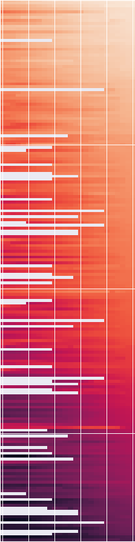
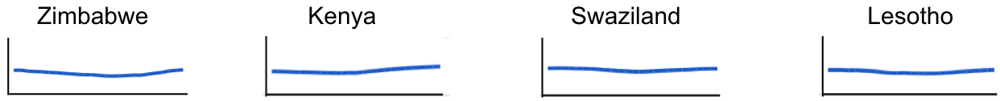

# Human Development Index: 1990 - 2015

## Executive Summary

The Human Development Index (HDI) is a national-level composite measure of human development, which combines indicators on health and longevity, education, and standard of living. Country scores are normalized to a value between zero and one.

The dataset:
* Analysis was done on a CSV dataset with HDI scores for each year from 1990 (the year the index was launched) to 2015 for 188 countries. Analysis was also done on regional HDI scores, which were calculated as the average of countries within each region for each year.
* The visualization to the right shows the annual HDI score (left to right) for each of the countries, ordered from highest to lowest 2015 HDI rank (top to bottom). The darker color represents lower scores and lighter is higher scores. White spaces are missing values.
* Data spread is consistent over the period, with an increase of ~10% across the dataset:

| Measure        | 1990 HDI scores| 2015 HDI scores| Difference|
| -------------  |:-------------:| :-------------:| :-------------:|
| Mean           | 0.6        | 0.7     |
| Std. deviation | 0.167  | 0.155 |  N/A |	
| Minimum	|0.21	|0.35	|0.14 |
| 25th percentile | 0.48 | 0.58 | 0.1 |
| Median	| 0.62 | 0.73 | 0.11 |
| 75th percentile | 0.73 | 0.81 | 0.08 |
| Maximum | 0.87 | 0.95 | 0.08 |

### High-level Insights:
* There is a steady positive trajectory of HDI scores over the 25-year period - globally, regionally, and for most countries. Eastern Europe/ Central Asia is the only region that show a slight downturn in HDI score – from the early to mid-90s after the fall of the Soviet Union. 
* Most regional average HDI scores are above the world average, except Sub-Saharan Africa, which is well below the world average. Asia Pacific HDI scores have hovered right around the world average. 
* 70% of countries had no more than two years of score downturn from the previous year. Four East and Southern African countries, however, each had 10+ years of HDI score downturns:

* Though education is considered to be strong in Zimbabwe, the economy has been consistently volatile and gross national income per capita has suffered over this period. All four countries lost at least 17 years of life expectancy from HIV/AIDS epidemic, but HDI scores have begun to recover.
* The countries with the four highest variance in HDI scores over the 25 years are:

* Rwanda’s development has increased rapidly since the mid-90s genocide. China has seen consistent strong improvements in all categories of the HDI over the period. Mozambique had the lowest HDI score in 1990, while the civil war there was ongoing. While HDI scores have improved since, the country remains low in HDI rank. Cambodia has seen significant jumps in life expectancy and income over the period, as well as improvement in education.

**Methodologies, potential for future analytical work, and a basic data visualization dashboard associated with the HDI dataset is available here: https://sites.google.com/view/hdi-1990-2015/home**
